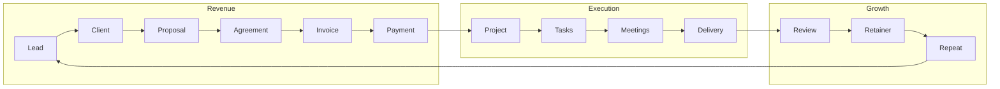

# 01 — Vision

> **Solo Suite**: An AI-powered Business Operating System for freelancers, consultants, creators, and small agencies.

---

## Purpose

Solo Suite exists to replace the 5–10 disconnected tools a solo business owner cobbles together to run their operation. Spreadsheets, Trello, Notion, Google Drive, calendar apps, proposal software, invoicing tools, basic CRMs — all replaced by one workspace.

The product is not merely a CRM. It combines CRM, project management, finance, documents, automation, AI, client collaboration, and Google Workspace into a single platform.

**Philosophy:** Run your entire business from one workspace while owning 100% of your data.

---

## Mission

Build the world's best Business Operating System for freelancers and small agencies.

---

## Core Principles

| Principle | Meaning |
|-----------|---------|
| **Google Workspace First** | Google Drive, Sheets, Calendar, Meet, Gmail, and Docs are the infrastructure layer. Not third-party add-ons. |
| **AI First** | AI is an agent that creates, summarizes, follows up, and automates — not just a chatbot. |
| **Automation First** | Trigger–condition–action automation is baked into every workflow from day one. |
| **User Owns Their Data** | All data lives in the user's Google Workspace. No vendor lock-in. No proprietary databases. |
| **Offline First** | Core functionality works without internet. Data syncs when connected. |
| **Desktop First** | Primary experience is a full-screen desktop web app. Mobile is a companion. |
| **Mobile Companion** | Key actions (view, approve, quick-create) available on mobile. |
| **Security by Default** | OAuth, RBAC, encryption, audit logs — built in, not bolted on. |
| **International by Default** | Multi-currency, multi-timezone, multi-tax-system from the start. |
| **Simplicity over Feature Bloat** | Every feature must justify its existence. If it can be removed without breaking a workflow, remove it. |
| **Business Workflow before Technical Workflow** | The sidebar and navigation follow the user's business process, not the software's internal architecture. |

---

## Evolution over Replacement (Architectural Principle)

> Never replace a subsystem when it can be extended.  
> Always introduce interfaces before implementations.  
> Prefer adapters over rewrites.  
> Prefer migrations over breaking changes.  
> Every subsystem must be replaceable.  
> Every integration must be optional.  
> Every workflow must degrade gracefully.  
> Every feature must be independently testable.

---

## Primary Users

**Solo Freelancer**
- Web Developer, Designer, SEO Expert, AI Consultant, Marketing Freelancer

**Small Agency**
- Website Agency, Marketing Agency, Software Agency, Design Studio

**Consultant**
- Business Consultant, Financial Consultant, Legal Consultant

---

## Business Workflow (Complete)

---

## Scope

### In Scope (v1)

| Module | Description |
|--------|-------------|
| Dashboard | Revenue, active projects, pending payments, tasks due, calendar, AI suggestions, lead conversion, business health |
| Leads | Pipeline CRM with stages, AI enrichment, follow-up reminders |
| Clients | Profile hub with contacts, projects, agreements, invoices, files, meetings, reviews, activity timeline |
| Projects | Milestones, tasks, files, meetings, agreements, timeline, AI assistant |
| Agreements | Proposal, Agreement, NDA, SOW, Change Request, Maintenance Agreement, Retainer Agreement — with versioning and e-signature |
| Finance & Accounting | Invoices, payments (manual verification), expenses, income, taxes, credit notes, financial reports |
| Retainers | Recurring work, recurring invoices, recurring reminders, recurring reports |
| Documents | Rich text editor (TipTap) with variables, AI writing, PDF export, e-signature, version history |
| Calendar | Google Calendar sync, tasks, meetings, deadlines, reminders |
| Reports | Revenue, pipeline, project health, exportable |
| Workspace | Solo and Agency mode, members, roles, permissions, capacity, activity |
| Client Portal | Project view, file upload, approvals, agreement signing, invoice view/pay, chat |
| AI (via MCP) | Provider-agnostic AI agent for project creation, proposals, summaries, follow-ups, reports |
| Automation | Trigger–condition–action engine for business process automation |
| Reviews | Public review page, portfolio, testimonials |

### Out of Scope (v1)

- Payment processing (Stripe/Razorpay/PayPal/Wise integration). Payment records are manual with receipt upload.
- Real-time collaboration in document editor (future enhancement).
- Native mobile apps (mobile companion via responsive web).
- Plugin SDK marketplace (SDK scaffold exists, marketplace is future).

---

## Standards

### Documentation

Documentation is the single source of truth. Code implements documentation. If they disagree, the documentation is updated only after an approved product decision — not to match implementation shortcuts.

### Engineering

Every feature must satisfy: Design → Engineering → Tests → UX → Accessibility → Performance → Security → Documentation → Review → Certified. Without all: **NOT DONE.**

### Architecture

- Adapter pattern for every external dependency
- Workspace Database abstraction (Google Sheets is v1 implementation)
- Event Bus with Business and System event channels
- Workspace Context Engine as runtime context authority
- Background Job Queue for async operations
- Feature Flags for gradual rollout
- Workspace Settings Registry as single source of configuration
- Workspace Intelligence layer (MCP + Context + Memory + AI)

---

## Templates

- `docs/adr/ADR-XXX-title.md` — Architecture Decision Record
- `docs/decision-log.md` — Product Decision Log
- `docs/future/*.md` — Future enhancement proposals

---

## Decisions

| Decision | Rationale |
|----------|-----------|
| Google Sheets as Database | Transparency, portability, easy backup, user data ownership, no vendor lock-in |
| No payment gateways | Freelancers manually verify payments; metadata-only approach matches real workflow |
| MCP for AI | Provider-agnostic; any compatible LLM can connect; no vendor dependence |
| TipTap (ProseMirror) | Professional rich text editing with variables, tables, comments, version history |
| Next.js monolith | Single framework for frontend + API routes; deploy to Vercel |
| Adapters for all Google APIs | Future-proof; swap implementations without rewriting modules |
| Workspace Context Engine | Single source of runtime context prevents scattered state management |

---

## Acceptance Criteria

- [ ] A freelancer can run their entire business from Solo Suite without opening another tool
- [ ] All business workflows are end-to-end: Lead → Repeat Business
- [ ] User owns all data in their Google Workspace
- [ ] Core functionality works offline
- [ ] AI assists in at least 5 workflows (proposals, summaries, follow-ups, reports, task creation)
- [ ] Client portal allows secure collaboration without exposing internal data

---

## Future Enhancements

- Payment gateway plugin (Stripe, Razorpay, PayPal via Plugin SDK)
- Real-time document collaboration
- Native mobile apps
- Plugin SDK marketplace
- PostgreSQL/Supabase adapter for Workspace Database
- Redis/BullMQ adapter for Job Queue
