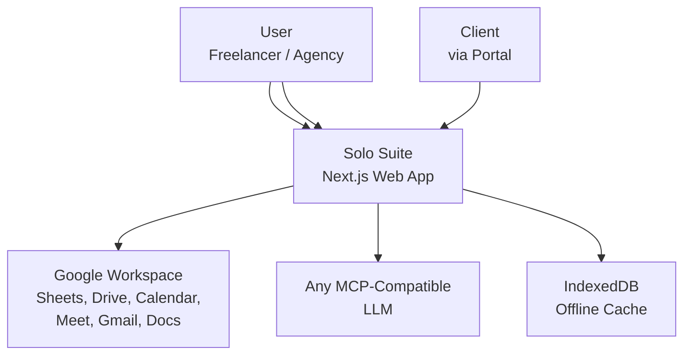
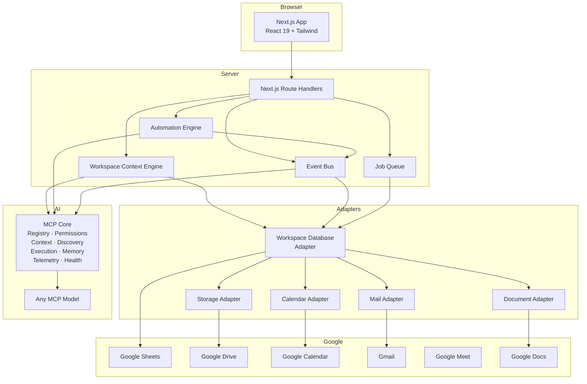
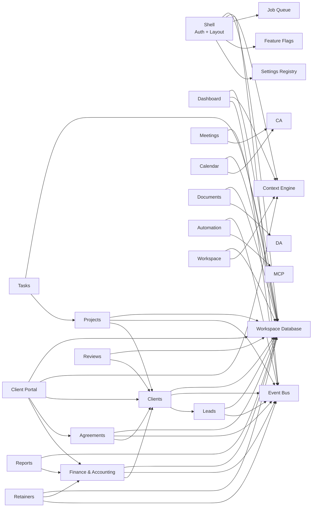
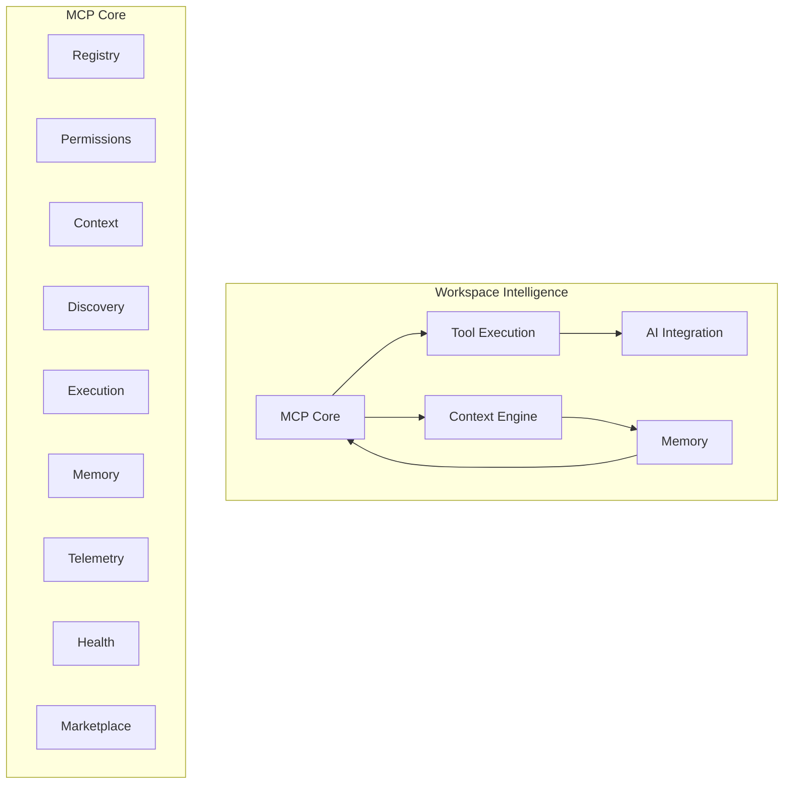
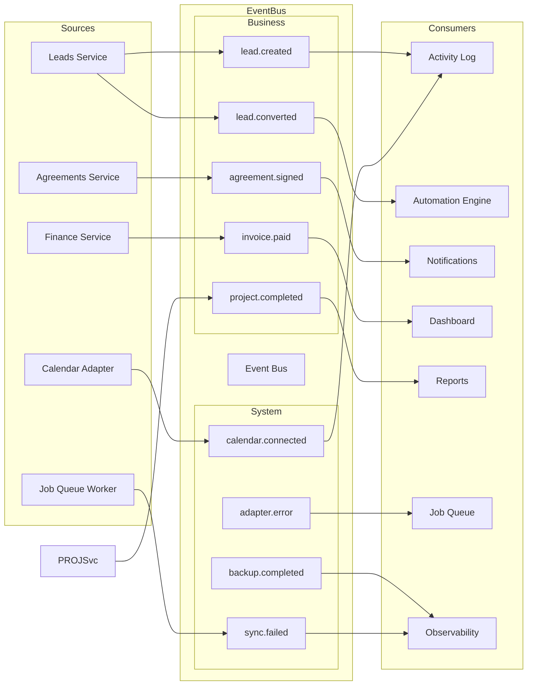
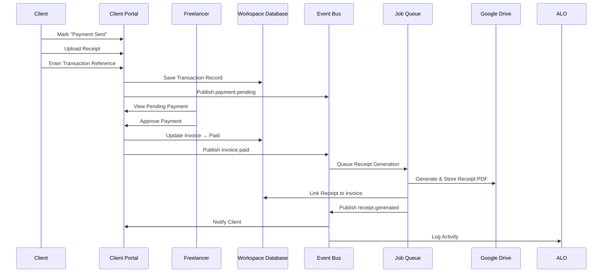

# 05 — System Architecture (ARD)

> Architectural overview of Solo Suite. Defines system context, containers, components, and data flow.

---

## Purpose

Define the architecture of Solo Suite: how systems interact, how data flows, and how modules are structured. This document is the architectural source of truth.

---

## System Context



---

## Container Architecture



---

## Module Dependency Graph



---

## Workspace Intelligence



---

## Event Flow



---

## Data Flow: Payment Verification



---

## Folder Structure

```
src/
├── app/                    # Next.js App Router pages
│   ├── (auth)/             # Login route
│   ├── dashboard/
│   ├── leads/
│   ├── clients/
│   ├── projects/
│   ├── agreements/
│   ├── finance/
│   ├── retainers/
│   ├── documents/
│   ├── calendar/
│   ├── reports/
│   ├── workspace/
│   ├── portal/             # Client portal routes
│   ├── reviews/
│   ├── settings/
│   ├── health/             # Workspace Health dashboard
│   ├── layout.tsx          # App shell
│   └── page.tsx            # Dashboard
├── components/
│   ├── ui/                 # Design system primitives
│   ├── layout/             # Shell components (sidebar, nav, etc.)
│   └── {module}/           # Per-module components
├── lib/
│   ├── mcp-core/           # Registry, Permissions, Context, Discovery, Execution, Memory, Telemetry, Health
│   ├── intelligence/       # Workspace Intelligence (MCP + Context + Memory + AI)
│   ├── workspace-context/  # Context Engine
│   ├── event-bus/          # Event Bus (Business + System)
│   ├── job-queue/          # Job Queue interface + InProcessAdapter
│   ├── automation/         # Automation Engine
│   ├── database/           # Workspace Database interface + GoogleSheetsAdapter
│   ├── storage/            # Storage Adapter interface + GoogleDriveAdapter
│   ├── calendar/           # Calendar Adapter interface + GoogleCalendarAdapter
│   ├── mail/               # Mail Adapter interface + GmailAdapter
│   ├── documents/          # Document Adapter interface + GoogleDocsAdapter
│   ├── feature-flags/      # Feature Flag service
│   ├── settings/           # Workspace Settings Registry
│   ├── import/             # Import Framework (CSV, JSON, Sheets)
│   ├── backup/             # Backup & Restore
│   ├── observability/      # Observability + logging
│   ├── migration/          # Data migration strategy
│   ├── plugin-sdk/         # Plugin SDK scaffold
│   ├── id/                 # Document ID generation
│   ├── auth/               # Auth.js configuration
│   └── utils/              # Shared utilities
├── types/                  # TypeScript type definitions
└── styles/                 # Global styles
```

---

## Adapter Interfaces

Every external dependency defines an interface in its adapter module:

| Interface | v1 Implementation | Future |
|-----------|------------------|--------|
| `WorkspaceDatabase` | `GoogleSheetsAdapter` | PostgreSQL, Supabase, SQLite |
| `StorageAdapter` | `GoogleDriveAdapter` | S3, LocalFS |
| `CalendarAdapter` | `GoogleCalendarAdapter` | Outlook Calendar |
| `MailAdapter` | `GmailAdapter` | SendGrid, SMTP |
| `DocumentAdapter` | `GoogleDocsAdapter` | OnlyOffice, Local |
| `JobQueue` | `InProcessQueueAdapter` | Redis, BullMQ, Cloud Tasks |

---

## Workspace Database Schema (v1)

### Sheets Tab: `leads`

| Column | Type | Description |
|--------|------|-------------|
| id | string | LD-{YEAR}-{SEQ} |
| name | string | Contact name |
| email | string | |
| phone | string | |
| source | string | |
| stage | string | New, Contacted, Qualified, Proposal Sent, Won, Lost |
| notes | string | |
| clientId | string | CL-{YEAR}-{SEQ} (if converted) |
| createdAt | datetime | |
| updatedAt | datetime | |

### Sheets Tab: `clients`

| Column | Type | Description |
|--------|------|-------------|
| id | string | CL-{YEAR}-{SEQ} |
| company | string | |
| contacts | string | JSON array |
| notes | string | |
| tags | string | |
| portalAccess | boolean | |
| createdAt | datetime | |
| updatedAt | datetime | |

### Sheets Tab: `agreements`

| Column | Type | Description |
|--------|------|-------------|
| id | string | AG-{YEAR}-{SEQ} |
| clientId | string | |
| type | string | Proposal, Agreement, NDA, SOW, Change, Maintenance, Retainer |
| status | string | Draft, Sent, Signed |
| version | number | |
| content | string | TipTap JSON |
| variables | string | JSON |
| signedAt | datetime | |
| createdAt | datetime | |
| updatedAt | datetime | |

### Sheets Tab: `invoices`

| Column | Type | Description |
|--------|------|-------------|
| id | string | INV-{YEAR}-{SEQ} |
| clientId | string | |
| lineItems | string | JSON array |
| subtotal | number | |
| tax | number | |
| taxType | string | GST, VAT, Sales Tax, Custom |
| total | number | |
| currency | string | |
| status | string | Draft, Sent, Partial, Paid, Overdue, Cancelled |
| sentAt | datetime | |
| paidAt | datetime | |
| dueDate | date | |
| createdAt | datetime | |
| updatedAt | datetime | |

### Sheets Tab: `transactions`

| Column | Type | Description |
|--------|------|-------------|
| id | string | TR-{YEAR}-{SEQ} |
| invoiceId | string | |
| clientId | string | |
| amount | number | |
| originalCurrency | string | |
| originalAmount | number | |
| baseCurrency | string | |
| exchangeRate | number | |
| convertedAmount | number | |
| method | string | Cash, Bank Transfer, UPI, etc. |
| reference | string | Client-provided ref |
| receiptLink | string | Drive URL |
| status | string | Pending, Approved, Rejected |
| notes | string | |
| createdAt | datetime | |
| updatedAt | datetime | |

### Sheets Tab: `expenses`

| Column | Type | Description |
|--------|------|-------------|
| id | string | EX-{YEAR}-{SEQ} |
| category | string | Hosting, Domain, Software, Ads, etc. |
| amount | number | |
| currency | string | |
| date | date | |
| description | string | |
| receiptLink | string | Drive URL |
| createdAt | datetime | |

### Sheets Tab: `projects`

| Column | Type | Description |
|--------|------|-------------|
| id | string | PR-{YEAR}-{SEQ} |
| clientId | string | |
| name | string | |
| status | string | Planning, Active, Paused, Completed, Archived |
| startDate | date | |
| endDate | date | |
| milestones | string | JSON array |
| agreementId | string | |
| createdAt | datetime | |
| updatedAt | datetime | |

### Sheets Tab: `tasks`

| Column | Type | Description |
|--------|------|-------------|
| id | string | TK-{YEAR}-{SEQ} |
| projectId | string | |
| title | string | |
| assignee | string | |
| dueDate | date | |
| priority | string | Low, Medium, High |
| status | string | To Do, In Progress, Done |
| createdAt | datetime | |

### Sheets Tab: `meetings`

| Column | Type | Description |
|--------|------|-------------|
| id | string | MT-{YEAR}-{SEQ} |
| projectId | string | |
| title | string | |
| date | datetime | |
| duration | number | Minutes |
| attendees | string | JSON array |
| notes | string | TipTap JSON |
| summary | string | AI generated |
| recordingLink | string | |
| createdAt | datetime | |

### Sheets Tab: `settings`

| Column | Type | Description |
|--------|------|-------------|
| key | string | |
| value | string | JSON |

### Sheets Tab: `automation`

| Column | Type | Description |
|--------|------|-------------|
| id | string | |
| name | string | |
| trigger | string | Event name |
| condition | string | JSON |
| action | string | JSON |
| enabled | boolean | |
| createdAt | datetime | |
| updatedAt | datetime | |

### Sheets Tab: `reviews`

| Column | Type | Description |
|--------|------|-------------|
| id | string | RV-{YEAR}-{SEQ} |
| clientId | string | |
| rating | number | 1-5 |
| text | string | |
| approved | boolean | |
| createdAt | datetime | |

### Sheets Tab: `jobs`

| Column | Type | Description |
|--------|------|-------------|
| id | string | |
| type | string | |
| status | string | Queued, Processing, Done, Failed |
| payload | string | JSON |
| result | string | JSON |
| error | string | |
| retries | number | |
| createdAt | datetime | |
| completedAt | datetime | |

---

## Standards

- All modules communicate through adapters, never directly to Google APIs
- All async work goes through the Job Queue
- All cross-module communication goes through the Event Bus
- All runtime context is read from the Context Engine
- All configuration is read from the Settings Registry
- All feature visibility is gated by Feature Flags
- All external service calls are non-blocking where possible

---

## Cross-References

- Vision: `01_Vision.md`
- PRD: `02_Product_Requirements_PRD.md`
- PDR: `03_Product_Decision_Record_PDR.md`
- Domain Model: `06_Domain_Model_DDD.md`
- Google Workspace: `11_Google_Workspace_Architecture.md`
- MCP: `12_MCP_Architecture.md`
- Automation: `13_Automation_Architecture.md`
- Security: `14_Security.md`
- Database: `10_Database_Architecture.md`

---

## Future Architecture

- Plugin SDK for extending the platform
- Payment gateway module as optional plugin
- Multi-adapter database with PostgreSQL
- Distributed job queue with Redis/BullMQ
- Real-time collaboration via WebSocket
